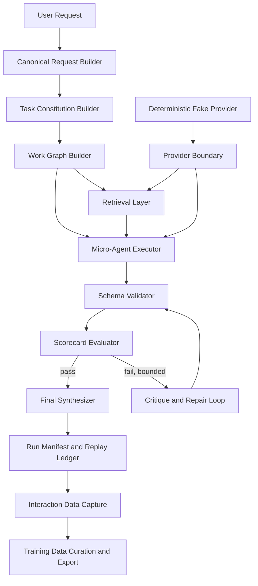

# Axia Hierarchical Reasoning Research Report

## Executive summary

Axia should be built around a simple premise: **tiny and small local models are usually not reliable general reasoners on their own, but they can become useful components inside a deterministic, typed, auditable control system**. The strongest evidence in the literature does **not** support relying on free-form chain-of-thought as a universal fix for small models. In the original Chain-of-Thought paper, CoT gains emerged mainly at very large scale, and the authors explicitly report that CoT “does not positively impact performance for small models,” with smaller models often producing fluent but illogical reasoning traces. More recent small-model work does show that reasoning can be improved, but much of that gain comes from specialization, distillation, structured decomposition, code/tool assistance, or controlled test-time compute—not from simply asking a weak model to “think harder.” citeturn35view0turn19search9turn2search0turn40search0

For an Axia MVP, the highest-value no-training methods are: **explicit task decomposition into typed subtasks; constrained structured outputs; deterministic validation; hybrid retrieval with provenance; lightweight reranking; calculator/code support for verifiable operations; bounded critique-repair loops; and replayable run manifests**. These methods align with evidence that weak models struggle with long contexts, context position sensitivity, instruction following under multiple constraints, and format reliability. LongBench shows that retrieval/compression can help weaker long-context models, but not enough to close the gap with genuinely stronger long-context models; “Lost in the Middle” shows that relevant information placed in the middle of long contexts is often used worse than information placed near the beginning or end; RULER shows that claimed long context windows often overstate usable long-context performance. citeturn35view3turn38search0turn38search2turn37view3

Axia should therefore treat the model as a **narrow semantic operator** surrounded by hard engineering controls. The product should prefer **artifact-based reasoning** over hidden or free-form reasoning: plans, subtask contracts, retrieval citations, assumptions, scorecards, critique records, repair attempts, and final synthesis artifacts. This matches the product requirement for auditability and also creates exactly the kind of structured interaction data that can later be exported into supervised fine-tuning, preference tuning, reward-model/verifier training, retrieval training, and evaluation datasets. citeturn35view8turn35view9turn37view5turn13search1turn13search2turn13search7

The most important architectural recommendation is to use **SQLite as the source-of-truth run ledger** plus **FTS5 for lexical retrieval**, then add an optional local dense index for semantic retrieval. SQLite FTS5 gives local, transactional, explainable BM25 ranking with no extra service; Qdrant and LanceDB both support hybrid retrieval patterns and are strong candidates when the corpus or query volume outgrows a simple embedded design; Chroma is easy to run locally and self-host. For structured outputs, Axia should default to **provider-level or inference-level constrained decoding** whenever possible: Ollama structured outputs, llama.cpp grammars, vLLM guided decoding, Outlines, or Guidance. Schema validation alone is not enough; the most reliable path is token-level constraint plus post-parse validation plus repair. citeturn36view9turn35view10turn36view8turn35view11turn35view5turn8search0turn36view7turn35view7turn36view5turn36view4

On live interaction data capture, Axia should keep the inference system and the data-curation system **separate but linked**. Normal usage should generate a rich trace, but exportable training examples should only be created after filtering and scoring. The most valuable retained artifacts are not only the raw prompt and final answer, but also the canonicalized request, task constitution, work graph, retrieved evidence with provenance, intermediate structured outputs, validation failures, repair attempts, critiques, chosen versus rejected alternatives, user edits, accepted final artifact, and effective model/runtime settings. Those artifacts map cleanly into SFT chat JSONL, instruction-output pairs, preference pairs for DPO/ORPO/KTO, critique-revision pairs, rejected-vs-accepted pairs, retrieval triples, verifier training instances, and custom evaluation cases. citeturn23search7turn37view9turn13search4turn13search1turn13search2turn13search7turn37view5turn33search2

## What the evidence says about tiny and small models

The clearest design constraint for Axia is that **small models fail in patterned ways**. They tend to be more brittle on multi-step reasoning, more sensitive to prompt wording and context placement, more likely to violate format contracts, and more likely to drift or hallucinate when the requested task requires latent world knowledge plus precise execution. The original CoT work is especially important here: it established a result that is often forgotten in later agent discussions—CoT prompting was an **emergent ability of scale**, and below that scale the generated “reasoning” often looked plausible but damaged accuracy. That is directly relevant to Axia, because it argues against making raw free-form reasoning traces a core product primitive for tiny local models. citeturn35view0

At the same time, “small model reasoning” is not empty hype. Recent work focused specifically on small language models reports improvements from **distillation, instruction tuning on reasoning traces, structural formatting, equation-only representations, synthetic data, and specialized training**. But those gains are mostly about **making small models better suited to a narrow distribution**, not proving that a weak model becomes a reliable general reasoner by default. For the Axia planning phase, that means the architecture should assume that **inference-time system design matters more than latent model cleverness** unless the user explicitly trains or fine-tunes later. citeturn35view1turn23search0

Another hard constraint is context handling. “Lost in the Middle” shows that model performance can fall sharply when relevant information is moved away from the start or end of context, even in models advertised for long-context usage. LongBench found that retrieval and context compression can improve outcomes for models with weak long-context ability, but still leave them behind stronger long-context models. RULER adds an important caution: models that look competent on simple needle tests often break when the long-context task requires multi-hop tracing or aggregation. For Axia, this means **do not pay for giant context windows unless you have measured usable recall and reasoning under your exact workloads**. Prefer selective retrieval, chunking, compression, and careful placement of critical evidence. citeturn38search0turn35view3turn37view3

Quantization is another core reality for local deployment. Recent studies on quantized reasoning models report that moderate quantization regimes can preserve much of the signal, but more aggressive low-bit setups increase accuracy risk, especially on mathematical, scientific, and coding-style reasoning. Work focused on SLM quantization argues that small models have distinct quantization sensitivities and cannot simply inherit “best practices” from larger-model compression. A newer study on structured output reliability also reports a crucial engineering tradeoff: constrained decoding can greatly improve syntax validity, but it can add latency and sometimes degrade task performance. For Axia, that implies a concrete model-profile layer: every supported model should carry **measured** profiles for answer quality, schema validity, tool calling reliability, latency, and quantized-vs-nonquantized behavior. citeturn19search6turn19search0turn19search3

The most promising reasoning enhancements for Axia are therefore the ones that **reduce compositional burden** on the base model.

| Technique | What it does | Evidence for small-model usefulness | Runtime cost | Main failure mode | Axia MVP priority |
|---|---|---:|---:|---|---:|
| Explicit decomposition | Break task into smaller subtasks with explicit interfaces | High | Low-Med | Bad decomposition propagates downstream | Very high |
| Plan-and-Solve | Force plan first, then solve | Medium | Medium | Planner emits shallow or wrong plan | High |
| Least-to-Most | Solve easier subproblems first | Medium | Medium | Subproblem chain drifts or compounds error | High |
| Program-of-Thought / calculator / code | Offload arithmetic or symbolic steps into executable form | High for math/data tasks | Medium | Tool misuse or sandbox failures | Very high |
| Self-consistency | Sample several candidates, choose majority/best | Medium when base model already has non-trivial success | High | Wasted compute when all candidates are bad | Medium |
| Generate-then-rank | Produce alternatives then score/rank | Medium | Medium | Weak scorer picks fluent wrong answer | High |
| Answer-critique-repair | Criticize then revise under rubric | Medium | Medium | Self-reinforced error loops | High |
| ReAct | Interleave reasoning with tool use | Medium for retrieval/tool tasks | Medium | Overlong traces, tool thrashing | Medium |
| Reflexion / Self-Refine | Store feedback/reflections, retry | Mixed | Medium-High | Same weak model critiques weakly | Medium-Low |
| Tree/Graph of Thoughts | Search many candidate reasoning branches | Weak for constrained local MVP | High-Very high | Compute explosion, marginal gains | Low |
| Debate / multi-agent critique | Multiple agents argue and refine | Mixed | High | Consensus on fluent nonsense | Low |
| Verifier-guided search | Use verifier to explore and prune | High upside if verifier is good | High | Imperfect verifier can mislead search | Medium |

The table above reflects a consistent pattern in the literature. Zero-shot CoT can help larger models, but Plan-and-Solve was created specifically because Zero-shot CoT often suffers from missing-step, calculation, and semantic-understanding errors. Least-to-Most improves easy-to-hard generalization by explicitly decomposing the problem into simpler subproblems. Program-of-Thought and code-enhanced reasoning are attractive because they turn reasoning into something externally verifiable. Self-consistency and broader test-time compute can help substantially when the base model already has some chance of success, and recent inference-scaling work shows that extra inference compute can sometimes let a smaller model beat a much larger one at equal FLOPs. But that only works when the search or verifier can reliably discriminate better answers. Studies of verifier-guided search warn that this does not scale cleanly with imperfect verifiers. citeturn40search0turn32search3turn31search3turn31search15turn17search1turn22search0turn22search4turn22search5turn22search15turn39search0turn39search2

**What works best for Axia:** decomposition, typed subtask outputs, generate-then-rank under clear rubrics, executable tools for arithmetic/code/transforms, and at most one bounded critique-repair cycle. **What likely overpromises for Axia MVP:** heavy ToT/GoT search, same-model debate, unbounded reflection loops, and any technique that assumes the model can faithfully self-evaluate without external checks. Those heavier techniques are better treated as experimental extensions after Axia has a strong evaluation harness. citeturn31search2turn31search13turn39search0turn39search2turn21search3

## Memory, context, structured output, and tool stack

For small local models, context management is not a luxury feature. It is the main way to turn a weak stateless generator into a system that appears persistent and task-aware. The foundational memory picture is simple: **working memory** should be short, task-bound, and aggressively curated; **episodic memory** should store past runs and outcomes; **semantic memory** should store distilled facts and reusable knowledge; **user preference memory** should store stable preferences under explicit provenance and confidence. MemGPT introduced the “virtual context” analogy, arguing that hierarchical memory can page information between limited context and external storage; Letta’s later “memory blocks” framing turns that into a practical abstraction by dividing context into discrete, purpose-specific blocks. citeturn11search0turn11search3turn36view3

For Axia, a pragmatic memory design is better than a “remember everything” design. The system should store: a small **session state block** for current task commitments, a **user profile block** for durable preferences, a **project/task block** for task-specific facts and reusable artifacts, and a **retrieval cache block** for evidence references used during the current run. Promotion into long-term memory should be **rule-based and scored**, not automatic. This matters because memory retrieval mistakes are expensive with small models: once stale or contradictory memory is injected into context, a weak model often lacks the robustness to question it. citeturn36view3turn11search0

For retrieval, Axia should assume that **hybrid retrieval beats dense-only retrieval** in many practical local setups, especially on user files, code, settings, logs, and business text with exact terms. SQLite FTS5 gives explainable BM25 ranking with transactionality and zero extra service overhead. Qdrant and LanceDB both support hybrid search patterns and reranking; LanceDB explicitly documents FTS plus vector search plus reranking, with RRF by default; Qdrant documents hybrid queries that combine sparse and dense vectors using fusion such as RRF. A small local reranker like `cross-encoder/ms-marco-MiniLM-L-6-v2` is often a good fit because it gives substantial quality improvement at modest cost. Query rewriting can help retrieval quality in multi-hop or underspecified requests, but it should be used carefully and logged as a first-class artifact, not inserted invisibly into the pipeline. citeturn36view9turn35view10turn36view8turn12search7turn12search2

Structured outputs are non-negotiable for Axia. Small models are too brittle to trust with “please output valid JSON.” Provider-level structured output systems are now mature enough to be part of the default path. OpenAI Structured Outputs guarantee adherence to a supplied JSON Schema; strict function calling builds on that and requires `additionalProperties: false` and fully required fields. Anthropic explicitly recommends Structured Outputs for guaranteed schema conformance and its docs also describe strict tool use for validated tool inputs. Gemini supports structured outputs against a subset of JSON Schema. Ollama now supports JSON-schema-based structured outputs locally, which is directly relevant to Axia’s local-first objective. At the inference layer, Outlines, Guidance, llama.cpp grammars, Jsonformer, LMQL, and vLLM guided decoding provide provider-agnostic or local-only options. citeturn35view8turn35view9turn20search1turn20search10turn20search19turn20search2turn20search5turn35view5turn24search3turn35view7turn36view5turn8search0turn8search2turn8search3turn36view7

The best Axia stack is therefore a layered one: **constrained decoding first, schema validation second, repair loop third**. Constrained decoding handles syntax and schema shape. Validation handles semantic checks and invariants that JSON Schema cannot express. Repair handles the remaining cases, but only with bounded retries. This is important because recent work on structured-output reliability warns that strict output contracts can impose latency and even hurt task performance if overused; Axia should keep schemas small, flat where possible, and staged across pipeline steps instead of demanding one giant nested object from a 1B–7B model. citeturn19search3turn35view8turn35view5turn35view7

A recommended tool stack for MVP is below.

| Layer | Recommended default | Why it fits Axia | Alternatives |
|---|---|---|---|
| Orchestration | **LangGraph** or a thin internal state machine | Explicit state, long-running flows, replayable steps | Haystack pipelines, LlamaIndex workflows |
| Validation/types | **Pydantic** + JSON Schema | Strong Python ergonomics, typed contracts | msgspec, dataclasses + custom validators |
| Structured decoding | **Ollama structured outputs** when available; otherwise **Outlines** or **llama.cpp grammars** | Local-first, provider-agnostic fallbacks | Guidance, vLLM guided decoding, Jsonformer |
| Source-of-truth store | **SQLite** | Local, transactional, auditable, exportable | DuckDB for analytics; Postgres later if needed |
| Lexical retrieval | **SQLite FTS5** | Fast, embedded, explainable BM25 | Tantivy-based stores later |
| Dense/hybrid retrieval | **LanceDB** embedded or **Qdrant** local | Good hybrid support and local deployment | Chroma for ease-of-use, FAISS for raw vector search |
| Reranking | **MiniLM cross-encoder** | Small and local-friendly | BGE rerankers if multilingual/quality needed |
| Memory abstraction | **Internal memory-block model** | Keeps Axia’s schema stable and auditable | Letta/Mem0 if later desired |
| Eval harness | **lm-eval-harness** + Axia custom suite | Standard benchmark integration | Lighteval, OpenAI Evals |

The highest-confidence framework findings are these. LangGraph is strong for explicit orchestration and stateful execution. Haystack is good for transparent component pipelines, especially if you want explicit indexing and query graphs. LlamaIndex has useful structured-output and indexing modules, but its surface area is broader and more opinionated than Axia needs for an MVP. Instructor and PydanticAI are good ergonomics layers around type-safe outputs and retries, but Axia should still own the run-manifest and replay system. Chroma is easy to run locally; LanceDB and Qdrant are stronger hybrid-retrieval choices when retrieval itself becomes more central; FAISS is excellent when you just need fast dense vector search and do not want a fuller retrieval platform. citeturn35view6turn36view1turn36view0turn36view4turn36view6turn35view11turn36view8turn35view10turn36view10

## Live interaction data curation and Axia data model

Axia’s data-capture layer should be designed as if it were building a future dataset **on every run**, but it should not automatically mark every run as export-worthy. The central rule is: **store richly, export selectively**. This is how Axia can preserve auditable intermediate work without diluting inference architecture or later poisoning fine-tuning data with low-quality traces. Preference-learning and RLHF work consistently show that data quality matters as much as algorithm choice. RewardBench emphasizes prompt-chosen-rejected triples for evaluating reward models; the SHP and OpenAI summarization datasets show the long-term value of explicit preference or comparison data rather than only final answers. citeturn37view5turn34search1turn34search2

The highest-value retained artifacts per interaction are:

- raw user request and canonicalized request  
- inferred intent, constraints, safety/risk flags, and requested output contract  
- task constitution and work graph  
- retrieved context chunks, retrieval queries, reranker scores, and provenance  
- prompts or prompt hashes, model identity, quantization mode, decoding parameters  
- intermediate typed artifacts from each micro-step  
- validation results, repair attempts, critiques, and scorecards  
- alternative candidates, including rejected drafts and rejection reasons  
- tool calls and tool results  
- final accepted answer or artifact  
- user edits, explicit corrections, and optional pairwise preferences  
- timestamps, run ID, artifact hashes, privacy/redaction flags, and export eligibility flags

That structure lets one interaction feed many future objectives. A final accepted artifact can become an SFT example. A rejected draft paired with an accepted draft becomes a preference example. A critique plus repaired output becomes a critique-revision example. Retrieved chunks with chosen relevance become a retrieval triple. A failed validation plus corrected artifact becomes a verifier/repair example. A user correction becomes a high-value alignment datapoint. citeturn37view9turn13search1turn13search2turn13search7turn33search2

A minimum viable Axia data model should look like this:

```json
{
  "InteractionRecord": {
    "interaction_id": "uuid",
    "user_id": "string",
    "session_id": "string",
    "timestamp_start": "iso8601",
    "timestamp_end": "iso8601",
    "capture_mode": {
      "enabled": true,
      "privacy_level": "raw|redacted|disabled"
    },
    "raw_user_request": "string",
    "canonical_request_id": "uuid",
    "final_run_id": "uuid",
    "final_artifact_id": "uuid|null",
    "user_acceptance": {
      "accepted": true,
      "explicit_rating": 4,
      "edited_after_accept": true
    },
    "export_flags": {
      "eligible_sft": true,
      "eligible_preference": false,
      "eligible_eval": true,
      "contains_sensitive_data": false
    }
  }
}
```

```json
{
  "RunManifest": {
    "run_id": "uuid",
    "interaction_id": "uuid",
    "provider": "ollama|openai-compatible|llama.cpp|vllm|other",
    "model_profile_id": "string",
    "model_name": "string",
    "quantization": "q4|q8|fp16|unknown",
    "decoding": {
      "temperature": 0.2,
      "top_p": 0.95,
      "max_tokens": 512,
      "seed": 42
    },
    "task_constitution_id": "uuid",
    "work_graph_id": "uuid",
    "retrieval_record_ids": ["uuid"],
    "artifact_ids": ["uuid"],
    "scorecard_ids": ["uuid"],
    "replay_hash": "sha256",
    "status": "success|failed|partial"
  }
}
```

```json
{
  "ArtifactRecord": {
    "artifact_id": "uuid",
    "run_id": "uuid",
    "artifact_type": "plan|subtask_output|critique|repair|final_answer|tool_result",
    "schema_name": "string",
    "schema_version": "semver",
    "content_hash": "sha256",
    "content_json": {},
    "producer_step": "string",
    "parent_artifact_ids": ["uuid"],
    "provenance": {
      "source_chunks": ["chunk_id"],
      "tool_calls": ["tool_call_id"]
    }
  }
}
```

```json
{
  "ScorecardRecord": {
    "scorecard_id": "uuid",
    "artifact_id": "uuid",
    "rubric_version": "semver",
    "scores": {
      "schema_valid": 1.0,
      "groundedness": 0.8,
      "completeness": 0.7,
      "constraint_following": 1.0,
      "tool_correctness": 1.0
    },
    "threshold_pass": true,
    "judge_type": "deterministic|llm_judge|hybrid",
    "judge_evidence": ["artifact_id", "chunk_id"]
  }
}
```

```json
{
  "PreferenceRecord": {
    "preference_id": "uuid",
    "interaction_id": "uuid",
    "prompt_ref": "canonical_request_id",
    "chosen_artifact_id": "uuid",
    "rejected_artifact_id": "uuid",
    "preference_source": "user|rubric|hybrid",
    "strength": 0.8,
    "reason_codes": ["better_grounding", "fewer_errors"]
  }
}
```

```json
{
  "CorrectionRecord": {
    "correction_id": "uuid",
    "artifact_id": "uuid",
    "corrected_by": "user|system|editor_model",
    "before_hash": "sha256",
    "after_hash": "sha256",
    "edit_type": "fact_fix|format_fix|style_fix|constraint_fix",
    "diff_summary": "string"
  }
}
```

```json
{
  "RetrievalRecord": {
    "retrieval_id": "uuid",
    "run_id": "uuid",
    "query_text": "string",
    "query_rewrite_text": "string|null",
    "retriever_type": "fts5|dense|hybrid",
    "candidates": [
      {
        "chunk_id": "string",
        "source_doc_id": "string",
        "bm25_score": 3.1,
        "vector_score": 0.78,
        "rerank_score": 0.91,
        "selected": true
      }
    ]
  }
}
```

```json
{
  "TrainingExample": {
    "example_id": "uuid",
    "source_interaction_id": "uuid",
    "task_type": "sft|dpo|retrieval|verifier|eval",
    "format": "chat_jsonl|instruction_jsonl|preference_pair|retrieval_triple",
    "payload": {},
    "quality_score": 0.92,
    "split": "train|val|test",
    "dedup_key": "sha256",
    "dataset_version": "semver"
  }
}
```

```json
{
  "ExportManifest": {
    "export_id": "uuid",
    "created_at": "iso8601",
    "dataset_name": "axia_export_2026_06_18",
    "included_example_ids": ["uuid"],
    "filters": {
      "min_quality": 0.8,
      "exclude_sensitive": true,
      "task_types": ["sft", "preference", "eval"]
    },
    "lineage": {
      "source_run_hashes": ["sha256"],
      "schema_versions": ["v1.0.0"]
    }
  }
}
```

```json
{
  "DatasetCard": {
    "name": "string",
    "motivation": "string",
    "composition": {
      "num_examples": 10000,
      "task_mix": {"sft": 6000, "preference": 2000, "eval": 2000}
    },
    "collection_process": "string",
    "known_limitations": ["string"],
    "sensitive_data_handling": "string",
    "recommended_uses": ["string"],
    "prohibited_uses": ["string"],
    "contamination_controls": ["string"]
  }
}
```

The best export formats for Axia are:

| Export format | Best for | Minimum fields from Axia | Main risk |
|---|---|---|---|
| Chat JSONL | SFT / instruction tuning | canonical request, optional system message, accepted final answer | style overfitting if prompts are inconsistent |
| Instruction/Input/Output JSONL | simple local SFT | canonical instruction, context input, accepted output | loses conversation structure |
| Preference pair JSONL | DPO / ORPO / KTO | prompt, chosen output, rejected output | noisy or weak preferences |
| Critique-revision pairs | repair model / editor training | initial output, critique, revised output | critique may be low quality |
| Rejected-vs-accepted pairs | answer ranking / reward modeling | prompt, rejected, accepted, reason | acceptance signal may reflect style not truth |
| Retrieval triples | retriever/reranker training | query, positive chunk, hard negative | negative mining errors |
| Verifier examples | rubric/judge training | prompt, candidate output, rubric labels | labels may be inconsistent |
| Eval cases | regression suite | prompt, gold artifact, rubric/expected constraints | benchmark leakage if reused carelessly |

Quality control is where Axia can create real leverage. The literature on dataset documentation, contamination, and preference data strongly supports adding: deduplication, lineage, split hygiene, contamination checks, sensitive-data detection/redaction, and explicit dataset documentation. Datasheets for Datasets and Data Cards provide strong templates. Contamination studies show that naïve string matching is not enough, because paraphrased or translated benchmark overlap can still leak. Presidio is a practical open-source redaction layer, but its own documentation warns that automated PII detection is imperfect, so Axia should preserve both a redaction decision and a confidence score. citeturn14search3turn14search0turn14search1turn14search7turn14search16turn14search2turn14search5

## Benchmark and evaluation plan

Axia needs two evaluation layers: **public benchmark tracking** and **Axia-specific system evals**.

Public benchmarks are useful, but only when they are matched to the subsystem being tested. GSM8K remains valuable for short multi-step arithmetic reasoning. BBH is useful for broad reasoning, though it is aging; BBEH is harder but may be too punishing for tiny-model MVP comparisons. MMLU remains a broad capability check, while MMLU-Pro is more reasoning-focused and less saturated. GPQA is excellent for difficult scientific reasoning, but for Axia MVP it is more of a stretch benchmark than a day-to-day target. IFEval and WildIFEval are especially relevant because Axia’s value proposition includes constraint following and structured task execution. HumanEval and MBPP are useful if Axia will support local coding or code-tool workflows. LongBench, RULER, and needle-style tests are important for retrieval and long-context behavior, but should be treated as **diagnostics**, not evidence that the whole system is “smart.” BFCL is highly relevant if Axia introduces tool/function calling, and RewardBench is useful if Axia later trains or selects reward models or judges. citeturn15search0turn15search1turn15search5turn16search0turn17search0turn37view1turn37view2turn17search1turn17search2turn35view3turn37view3turn37view4turn37view5

A sensible Axia benchmark suite should look like this:

| Benchmark bucket | Recommended tasks | Why it matters for Axia |
|---|---|---|
| Short reasoning | GSM8K, BBH subset, ARC-Challenge subset | Measures uplift from decomposition and repair |
| Instruction / constraint following | IFEval, WildIFEval, custom schema tasks | Directly measures constitution + validation path |
| Retrieval grounding | HotpotQA, MuSiQue, retrieval triples, custom doc QA | Measures hybrid retrieval and evidence use |
| Long-context behavior | LongBench subset, RULER subset, lost-in-middle probes | Measures selective context assembly vs brute-force context |
| Structured output | custom strict JSON suite | Measures parseability, schema conformance, repair success |
| Tool use | BFCL subset, calculator/code tasks | Measures argument accuracy and abstention |
| Coding | HumanEval, MBPP, local file-transform tasks | Relevant if Axia supports local code help |
| Axia-specific workflow tasks | decomposition traces, critique usefulness, replay determinism | Measures the product, not just the model |

The most important Axia-specific metrics are not standard leaderboard metrics. They are:

- **single-shot baseline vs orchestrated uplift**  
- **schema validity rate** on first pass and after repair  
- **retry success rate** and average retries per success  
- **retrieval hit rate** and reranker win rate  
- **groundedness / citation correctness**  
- **contradiction rate** across artifacts within one run  
- **trace replayability** from manifest + seed  
- **latency and cost per accepted artifact**  
- **tool-call validity** and abstention correctness  
- **user edit distance** from final system output to accepted artifact  
- **training-example acceptance rate** after curation  
- **preference-pair usefulness** measured by downstream reward/judge performance

One especially important benchmark principle: **never rely on final-answer accuracy alone**. Axia’s whole point is that intermediate engineering controls improve reliability. That means the evaluation harness must score the path, not only the endpoint. OpenAI’s Evals guidance is directionally right here: specify the desired behavior, run test cases, analyze failures, repeat. The EleutherAI lm-evaluation-harness is the best standard harness to integrate first; Lighteval is attractive if you want sample-by-sample result exploration across different backends. citeturn37view8turn37view6turn37view7

## Recommended Axia MVP architecture and roadmap

Axia’s MVP should be a **local-first orchestration runtime** with a strict provider boundary. Ollama is the default local provider because its API is simple, local, and now supports structured outputs and embeddings, but the architecture should also support llama.cpp, vLLM, and generic OpenAI-compatible endpoints. The provider boundary should expose one uniform interface for: completion/chat, structured generation capability, embeddings, tool-call capability, context window, and model-specific quirks. citeturn36view11turn35view5turn24search20

A concrete MVP architecture:



The core components should behave like this:

**Canonical Request Builder.** Normalize the user request into a machine-actionable form: objective, constraints, requested format, allowed tools, retrieval need, risk flags, and success criteria. This is where Axia should strip away conversational noise and produce a compact “constitution object” rather than pass the raw chat history into every step.

**Task Constitution Builder.** Emit a typed object describing the task. Example fields: `task_type`, `required_outputs`, `must_cite`, `needs_retrieval`, `needs_tooling`, `max_retries`, `quality_thresholds`, `privacy_policy`, `memory_policy`.

**Work Graph Builder.** Turn the constitution into a DAG of micro-steps with typed output contracts. For a research task: clarify scope → retrieve evidence → extract claims → synthesize outline → draft answer → validate citations → critique → finalize. For a data-extraction task: retrieve document → extract fields as JSON → validate → repair → emit final object.

**Micro-Agent Executor.** Each node is small and narrow. The model never gets “solve the whole problem” unless the task is trivial. Most nodes should ask for one typed artifact only.

**Retrieval Layer.** Use SQLite FTS5 + local embeddings by default. Add dense/hybrid only when needed. Retrieval output should always be a **RetrievalRecord**, never raw pasted text without provenance.

**Schema Validator.** Validate syntax, schema, and domain checks. Domain checks can include enums, ranges, citation existence, required fields, maximum length, contradiction checks, or executable tests.

**Scorecard Evaluator.** Compute a rubric over the artifact: schema validity, completeness, evidence grounding, tool correctness, and task-specific correctness proxies. Deterministic checks should dominate. LLM-as-judge should be used narrowly, with rubrics and preferably ensemble or repeat-sample scoring when it matters, because single-shot LLM judgments are not reliably stable. citeturn21search1turn21search3turn21search0

**Critique and Repair Loop.** One bounded cycle by default. Critique must target explicit rubric failures. Repair produces a new typed artifact. Do not let a weak model roam in an unbounded introspection loop.

**Final Synthesizer.** Produce the user-facing output from audited intermediate artifacts, not from fresh unconstrained generation.

**Run Manifest and Replay System.** Every step, prompt hash, retrieved chunk ID, tool call, validation result, and scorecard should be stored by default. This is central both for debugging and for future dataset export.

**Interaction Data Capture Layer.** Always separate inference-useful state from export-oriented curation state.

**Deterministic Fake Provider.** A fake provider for offline tests should simulate valid JSON, invalid JSON, missing fields, wrong citations, and partial tool calls. This lets Axia test controller logic without needing a real model in CI.

A compact implementation roadmap:

| Stage | Goal | Deliverables |
|---|---|---|
| Foundation | make the system testable | provider boundary, model profiles, SQLite ledger, fake provider, canonical request builder |
| Reliability core | make outputs typed and replayable | work graph, schema validator, constrained decoding adapters, scorecards, bounded repair |
| Retrieval core | make context selective and grounded | document store, FTS5, embeddings, hybrid retrieval, reranker, provenance injection |
| Tooling core | offload deterministic subproblems | calculator, Python sandbox, file transforms, tool-call ledger |
| Data capture | convert usage into datasets | InteractionRecord family, filters, export formats, dataset card generator |
| Evaluation | measure uplift and regressions | public-benchmark harness, Axia-specific eval set, replay/regression suite |
| Advanced compute | explore extra inference-time gains | self-consistency, verifier-guided ranking, optional branch search |

The MVP should intentionally **not** include training, autonomous memory mutation without scoring, or heavy multi-agent search. Those all belong after Axia has measurements proving the simpler loop is stable.

## Risks, open questions, and annotated bibliography

The main risks are straightforward.

First, **controller overhead can erase model savings**. Small models are attractive partly because they are cheap, but if Axia turns one prompt into twelve sequential prompts plus reranking and repair, the latency budget may become worse than using a larger local model once. This is why bounded retries and step minimization matter. Test-time compute is powerful, but only when it is selectively applied to tasks where the base model already has some chance of success. citeturn22search0turn22search4

Second, **same-model critique is not a silver bullet**. Self-Refine and Reflexion show real gains, but they were not designed around the harshest small-model constraints, and verifier research keeps showing that the bottleneck becomes selection and judgment quality. Axia should assume critique helps only when the rubric is concrete and the repair budget is tight. citeturn39search0turn39search2turn22search5turn21search3

Third, **memory can become a corruption channel**. Long-term memory is valuable, but only if update rules, conflict resolution, provenance, and forgetting policies are explicit. Store less than you think; score before promotion.

Fourth, **dataset capture can silently poison future training** if the curation layer exports raw conversations indiscriminately. Without deduplication, benchmark decontamination, split discipline, sensitive-data controls, and quality scoring, the resulting dataset will be noisy and possibly unsafe. citeturn14search1turn14search16turn14search2turn14search3turn14search0

Open questions that deserve explicit experiments in Axia:

- At what model sizes and task families does decomposition stop helping because coordinator overhead dominates?
- What is the best local reranker under an 8–16 GB VRAM or CPU-only budget?
- How much does constrained decoding reduce semantic accuracy on the exact schemas Axia needs?
- Which long-term memory promotion rules best predict future utility without causing stale-context injection?
- Which preference signal is most useful for future tuning: explicit user ratings, accepted-vs-rejected drafts, or user edits?
- How often can a weak local model produce a useful critique if the rubric is fully structured?

A short annotated bibliography of the most decision-relevant sources:

**Wei et al., Chain-of-Thought Prompting Elicits Reasoning in Large Language Models.** Foundational result. Most important Axia takeaway: CoT gains were scale-dependent and did not help small models reliably. citeturn35view0

**Kojima et al., Large Language Models are Zero-Shot Reasoners.** Established Zero-shot CoT. Useful baseline, but not sufficient for Axia because the method is brittle on weaker models and missing-step errors motivated later work. citeturn40search9turn40search0

**Wang et al., Self-Consistency Improves Chain of Thought Reasoning.** Strong evidence that repeated sampling can help when the model already has some success probability. Important for optional Axia test-time compute. citeturn1search4

**Wang et al., Plan-and-Solve Prompting.** Directly relevant to Axia: plan first, then solve. A simple decomposition pattern that improves over Zero-shot CoT on multi-step tasks. citeturn40search0

**Zhou et al., Least-to-Most Prompting.** Strong support for decomposition into sequenced subproblems. Useful conceptual template for Axia work graphs. citeturn32search3

**Yao et al., ReAct.** Valuable when retrieval or tools are genuinely necessary, but should be used in a constrained way for Axia because unconstrained traces can bloat. citeturn2search3

**Madaan et al., Self-Refine.** Good evidence that iterative critique-repair can help, but Axia should apply it with bounded loops and typed rubrics. citeturn39search0

**Shinn et al., Reflexion.** Shows gains from reflective memory and verbal feedback across retries, but also illustrates why memory and retry policies must be treated as first-class system design. citeturn39search2

**Liu et al., Lost in the Middle.** Critical evidence against naïve long-context dumping. Directly supports selective retrieval and careful evidence placement. citeturn38search0turn38search2

**Bai et al., LongBench.** Strong evidence that retrieval/compression helps weak long-context models, but does not eliminate the underlying capability gap. citeturn15search2turn35view3

**Hsieh et al., RULER.** Important for testing usable context instead of only advertised context. Supports custom long-context Axia diagnostics. citeturn37view3

**Packer et al., MemGPT.** Foundational hierarchical memory framing. Useful conceptual basis for Axia memory tiers. citeturn11search0turn11search3

**Lewis et al., Retrieval-Augmented Generation.** Canonical rationale for explicit non-parametric memory and provenance-aware generation. citeturn12search0turn12search8

**Ma et al., Query Rewriting for Retrieval-Augmented LLMs.** Supports making query rewriting explicit and measurable in retrieval-heavy workflows. citeturn12search2

**Patil et al., BFCL.** Best current benchmark family for function/tool calling accuracy and abstention, highly relevant if Axia uses tools. citeturn37view4

**Lambert et al., RewardBench.** Important if Axia later builds judge/verifier models or preference-driven filters. citeturn37view5

**Rafailov et al., DPO; Hong et al., ORPO; Ethayarajh et al., KTO.** Key preference-optimization papers that determine how Axia should structure future preference exports. citeturn13search1turn13search2turn13search7

**Datasheets for Datasets; Data Cards.** Best-practice references for Axia dataset documentation, lineage, and transparency. citeturn14search3turn14search0

**OpenAI Structured Outputs, Anthropic Structured Outputs guidance, Gemini structured output docs, Ollama structured outputs, llama.cpp grammars, Outlines, Guidance, vLLM structured outputs.** Together these establish that constrained structured generation is now a practical systems primitive, not just a prompt trick. Axia should lean on this heavily. citeturn35view8turn20search1turn20search10turn20search2turn20search5turn35view5turn8search0turn35view7turn36view5turn36view7

The overall recommendation is crisp: **Axia should not try to make tiny models secretly behave like giant reasoning models. It should make them useful by narrowing their role, decomposing their work, validating every step, retrieving selectively, offloading deterministic subproblems, and preserving auditable artifacts that later become training data.** That architecture is implementable now, testable offline, compatible with constrained hardware, aligned with local-first deployment, and unusually well positioned to create a high-quality future fine-tuning and evaluation corpus from ordinary usage.